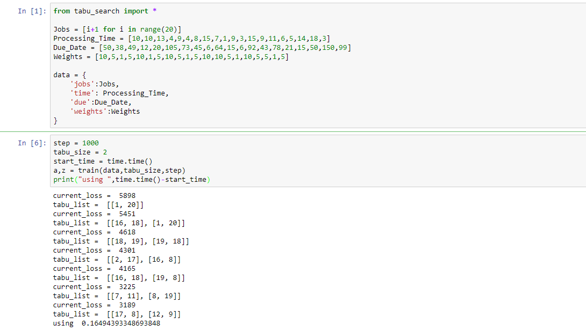

# tabu search for scheduling problem<br>
## problem description
你可能有很多工作，然後每個工作有不一樣的due date，但你只有一人的人力，每個東西delay又有不一樣的懲罰(就像可能你老闆要你做的事沒做出來你會比較慘，你朋友拜託你做的事可能沒做出來頂多傷感情而已?)，那你要怎麼去取得一個最小的損失去做這些事情呢?
## example data
```python
Jobs = [i+1 for i in range(20)]<br>
Processing_Time = [10,10,13,4,9,4,8,15,7,1,9,3,15,9,11,6,5,14,18,3]<br>
Due_Date = [50,38,49,12,20,105,73,45,6,64,15,6,92,43,78,21,15,50,150,99]<br>
Weights = [10,5,1,5,10,1,5,10,5,1,5,10,10,5,1,10,5,5,1,5]<br>\
```
## result
approximate optimal solution : [20, 12, 17, 5, 4, 11, 16, 1, 7, 9, 8, 2, 14, 15, 10, 13, 3, 6, 18, 19]<br>
fitness function value 2577<br>
running time : 325s<br>

tabu list size = 0<br>
steps = 1000000<br>

program usage<br>

